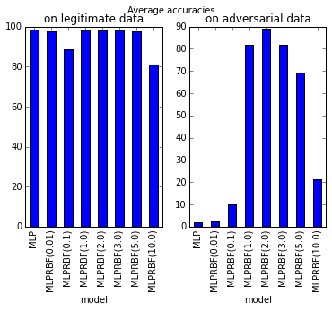

# rbf_tests

Adding RBF layer to learned deep learning model to prevent its
vulnerability to adversarial examples.

See [RBF_layer_to_prevent_adversarial.ipynb](https://github.com/PetraVidnerova/rbf_tests/blob/master/RBF_layer_to_prevent_adversarial.ipynb) for example.

## mnist_add_rbf 

Test of adding RBF layer to learned model. Requires [rbf_keras](https://github.com/PetraVidnerova/rbf_keras).

### Usage:
```
usage: mnist_add_rbf.py [-h] [--betas BETAS] [--cnn] input output

positional arguments:
  input          input model saved in input.json and input_weights.h5
  output         output model saved in output.json and output_weights.h5

optional arguments:
  -h, --help     show this help message and exit
  --betas BETAS  initial value for betas
  --cnn          cnn type network (2d input)
```


## eval_adversarial

Eval accuracy on test and adversarial examples. Requires [CleverHans](https://github.com/tensorflow/cleverhans).

### Usage:
```
usage: eval_adversarial.py [-h] [--cnn] model_name

positional arguments:
  model_name  model saved in model_name.json and model_name_weights.h5

optional arguments:
  -h, --help  show this help message and exit
  --cnn       cnn type network (2d input)	
```

## Results
(average errors from 30 runs)

### MLP
Average accuracy on legitimate data set:   98.35

Average accuracy on adversarial data set:   1.95

### MLP+RBF
Average accuracy on legitimate data set:   98.19

Average accuracy on adversarial data set:  89.21




### CNN
Average accuracy on legitimate data set:   98.97 

Average accuracy on adversarial data set:   8.49 

### CNN+RBF
Average accuracy on legitimate data set:   
Average accuracy on adversarial data set:  

